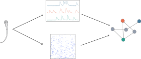

# Connectome-Constrained SNN Models

[](https://www.python.org/downloads/)
[](https://pytorch.org/)
[](https://docs.astral.sh/ruff/)
[](https://docs.astral.sh/uv/)
[](LICENSE)



PyTorch-based **library** for modelling dynamical connectomics datasets with
spiking neural networks (SNNs). Given a connectome (a wiring diagram of neural
connections), it builds SNN models that respect the observed connectivity and
trains them to reproduce experimentally recorded neural activity.

This is a **library**, not an experiment repo: experiments live in separate
project repos that install it as a dependency. The package is importable as
`connectome_snns`.

## What it provides

- **Network simulators** for current- and conductance-based spiking neurons, in recurrent and feedforward configurations (`connectome_snns.network_simulators`)
- **Topology generators** for synthetic connectomes with configurable statistics (`connectome_snns.synthetic_connectome`)
- **Training & inference** loops, including an approximate EM algorithm for partially observed networks (`connectome_snns.snn_runners`, `connectome_snns.training_utils`)
- **Dataloaders** for supervised/unsupervised teacher activity and odourant inputs (`connectome_snns.dataloaders`)
- **Analysis & visualization** — spike statistics, parameter recovery, plotting (`connectome_snns.analysis`, `connectome_snns.visualization`)
- **A reproducibility run framework** — `connectome_snns.run_experiment` / `run_grid_search` + `connectome_snns.utils.reproducibility`

## Structure

```
src/connectome_snns/
  network_simulators/   # SNN models (current-based, conductance-based, feedforward)
  snn_runners/          # training and inference loops
  training_utils/       # losses, surrogate gradients, schedules
  dataloaders/          # data loading and batching
  analysis/             # firing statistics, metrics, inference
  visualization/        # plotting helpers and colour palettes
  synthetic_connectome/ # synthetic connectivity generators
  configs/  observation_models/  utils/
  run_experiment.py  run_grid_search.py   # the run framework
```

## Use as a dependency

Project repos install it as a dependency (pin to a git rev for archival
reproducibility). Because torch is kept in optional extras, the base install
pulls no torch; consumers that need it own the torch index choice. For local
development alongside a project repo, an editable path dependency works well:

```toml
[project]
dependencies = ["connectome-snns"]

[tool.uv.sources]
connectome-snns = { path = "../connectome-snns", editable = true }
```

Then in code:

```python
from connectome_snns.utils.reproducibility import load_experiment_config
from connectome_snns.snn_runners import SNNTrainer
from connectome_snns import visualization
```

## Developing the library itself

We use [uv](https://docs.astral.sh/uv/). Sync with the extra matching the machine:

```bash
uv sync --extra cpu       # CPU
uv sync --extra cu129     # GPU (CUDA 12.9)
```

The run framework drives experiments from the *consumer* repos via their `./run`
wrappers (`python -m connectome_snns.run_experiment <config.toml>`), which check
for a clean commit then snapshot the commit hash, parameters, and input data
alongside the results — each output folder is self-contained and reproducible.

## Development

Install the pre-commit hooks (ruff lint + format):

```bash
uv run pre-commit install
```

Commit messages start with a [gitmoji](https://gitmoji.dev/) (e.g. `:sparkles:`,
`:bug:`, `:recycle:`). Since project repos depend on this one, prefer
**additive** changes and flag breaking API changes.
